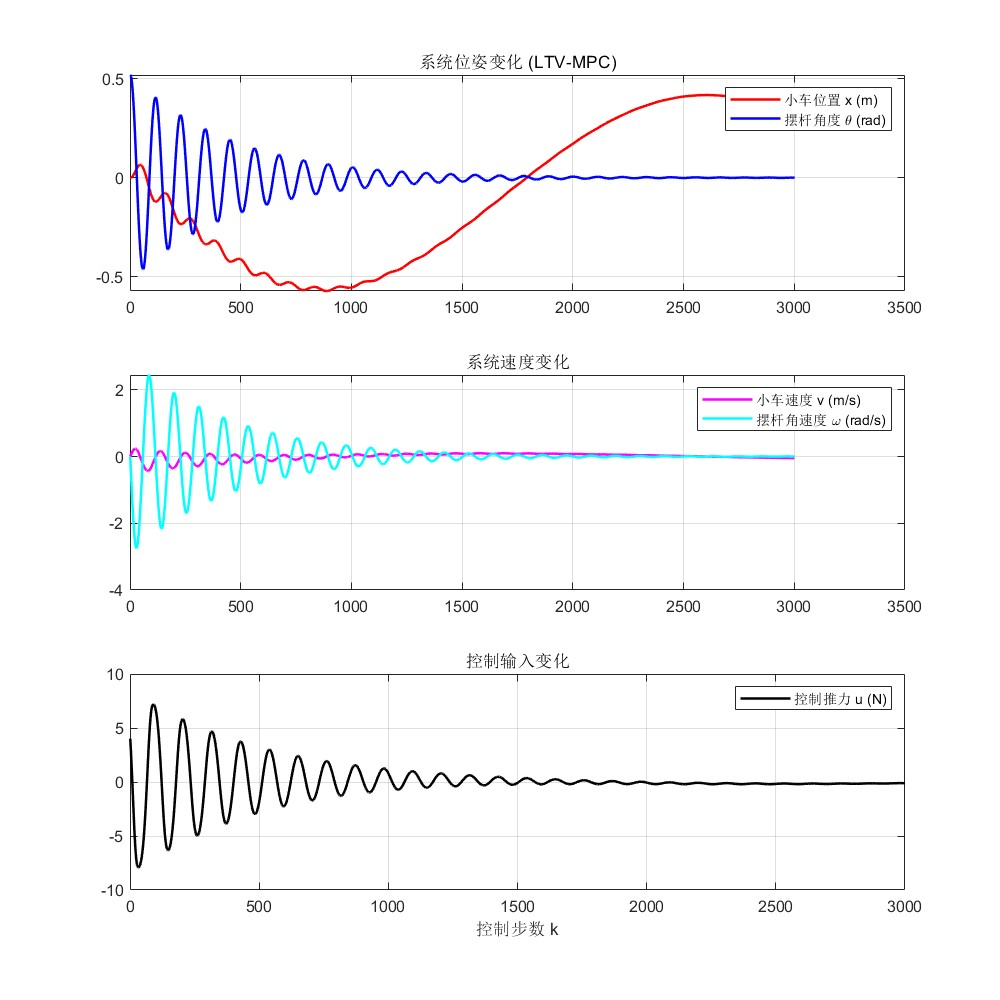
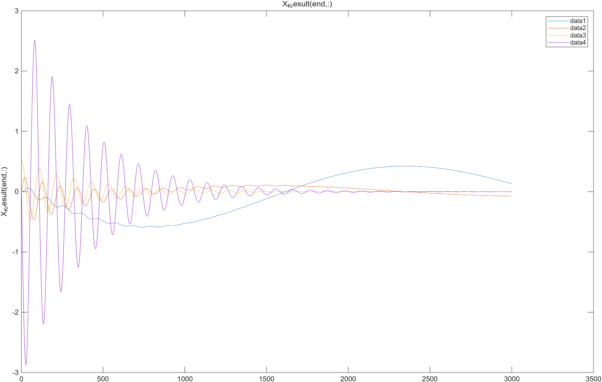

<!-- # 非线性MPC:应用于MuJoCo的倒立摆尝试  -->
## 代码简介
该项目首先在C++实现MATLAB的DR.CAN的MPC效果，之后将MPC部署在一阶倒立摆上，前置代码参见:https://github.com/yzjjx/LTV-MPC_MATLAB  
因为在C++配置Mujoco的仿真环境极其复杂，在后期，希望用python调用mujoco的simulate环境进行可视化展示，控制主循环使用C++代码
## 代码文件描述
* fig：用来存放README.md的图片文件
* include:用来存放头文件
* model:用来存放倒立摆的模型文件，文件来源:https://github.com/google-deepmind/dm_control/blob/main/dm_control/mujoco/testing/assets/cartpole_no_names.xml
* output:用来存放模型输出文件，文件格式为csv或txt
* python_code：用来存放python代码  
  python_code/show_cartpole.py：用python调用simulate环境来可视化倒立摆模型  
  python_code/pytbind_test.py:测试.so动态链接库文件是否有用
* scr:c++源代码文件夹  
  scr/MPC_Matrices.cpp：计算MPC所需要的所有矩阵  
  scr/Prediction.cpp:计算并且输出预测结果，利用qpOASES库  
  scr/MPC_test.cpp:最终计算MPC运行结果  
  scr/NMPC_C_and_MATLAB.cpp:NMPC的计算例子，公式来源为MATLAB的雅可比计算  
  scr/CartpoleMPC.cpp:控制器总程序，用来生成.so文件，方便python环境调用
  scr/bindcode.cpp:pybind，用来生成.so动态链接库文件
* test：测试文件夹  
  test/xml_open.cpp:用C++来打开mujoco模型
* from_matlab:表示来自MATLAB的文件
* python_output：用来存放python代码的输出文件

## 运行结果
### 1、常规MPC运行结果
scr/MPC_test.cpp:该代码运行结果与MATLAB版本的MPC_test运行结果一致
MATLAB运行结果:

<div align="center">
    
    <br>
    图1：MATLAB代码运行结果
</div>

<div align="center">
    
    <br>
    图2：MATLAB代码运行结果2
</div>

<div align="center">
    
    <br>
    图3：C++代码运行结果
</div>

<div align="center">
    
    <br>
    图4：C++代码运行结果2
</div>

### 2、非线性MPC运行结果
scr/NMPC_C_and_MATLAB.cpp：该代码运行结果与MATLAB版本的Cartpole_MPC运行结果一致，在初始关节角为30度时，运行结果如下：
MATLAB运行结果：

<div align="center">
    
    <br>
    图5：MATLAB代码运行结果
</div>

<div align="center">
    
    <br>
    图6：C++代码运行结果
</div>

### 3、非线性MPC：mujoco环境部署
使用`pybind11`建立python到C++之间的桥梁，使用这个工具将C++代码编译为python的动态库，`pybind1`的简单使用可以查看博客：https://www.cnblogs.com/smartljy/p/18608727  
首先将C++代码重构为控制器的类(class)，重构的文件为`scr/CartpoleMPC.cpp`与`include/CartpoleMPC.h`  
编译过程:  
在使用python的时候，选择了使用conda的混合编程，也就是说电脑环境里面同时存在了conda的虚拟环境和电脑本机的python环境，在使用的时候，电脑环境可能是python3.10,而conda环境可能是3.13,因此就要用conda的python环境为基准进行编译，下面为编译过程截图

<div align="center">
    
    <br>
    图7：编译过程
</div>

编译代码:
```
cmake -DPython3_EXECUTABLE=/home/yyy/anaconda3/bin/python \-Dpybind11_DIR=$(python -m pybind11 --cmakedir) \..
```
在编译之后，build环境里面就会出现新的文件，全称为`build/MPC_test1.cpython-313-x86_64-linux-gnu.so`:

<div align="center">
    
    <br>
    图8：编译生成文件
</div>

这个文件就是可以在python环境下运行、调用的**动态链接库文件**  
注意事项:  
bindcode文件里面，文件名字(MPC_test1)必须和`CMakeLists.txt`的文件名字是一样的，否则就会报错
`PYBIND11_MODULE(MPC_test1, m) `
#### 3.1 测试文件:python_code/pytbind_test.py 运行结果
在运行的时候，首先要进入你所定义的环境  
然后进入该程序所在的目录，在该目录下，输入代码`python pytbind_test.py`,即可出现运行结果，运行过程及其结果如下图所示

<div align="center">
    
    <br>
    图9：pybind测试计算结果
</div>

