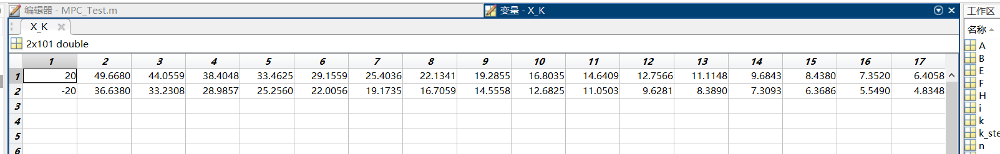
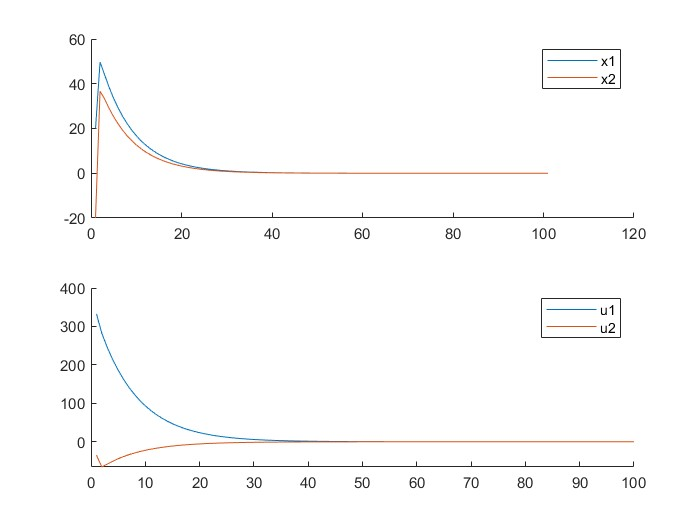
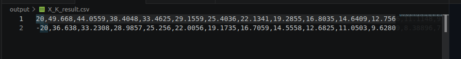
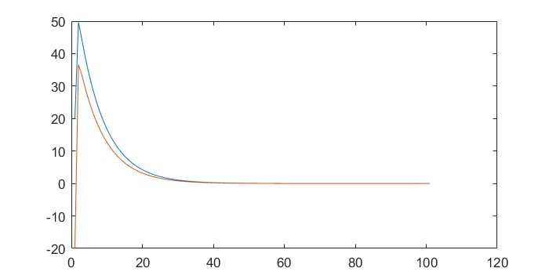

<!-- # 非线性MPC:应用于MuJoCo的倒立摆尝试  -->
## 代码简介
该项目首先在C++实现MATLAB的DR.CAN的MPC效果，之后将MPC部署在一阶倒立摆上，前置代码参见:https://github.com/yzjjx/LTV-MPC_MATLAB  
因为在C++配置Mujoco的仿真环境极其复杂，在后期，希望用python调用mujoco的simulate环境进行可视化展示，控制主循环使用C++代码
## 代码文件描述
* fig：用来存放README.md的图片文件
* include:用来存放头文件
* model:用来存放倒立摆的模型文件，文件来源:https://github.com/google-deepmind/dm_control/blob/main/dm_control/mujoco/testing/assets/cartpole_no_names.xml
* output:用来存放模型输出文件，文件格式为csv或txt
* python_code：用来存放python代码
* scr:c++源代码文件夹  
  scr/MPC_Matrices.cpp：计算MPC所需要的所有矩阵
  scr/Prediction.cpp:
  scr/MPC_test.cpp:
* test：测试文件夹  
  test/xml_open.cpp:用C++来打开mujoco模型

## 运行结果
scr/MPC_test.cpp:该代码运行结果与MATLAB版本的MPC_test运行结果一致
MATLAB运行结果:

    
     
    图1：MATLAB代码运行结果

    
     
    图1：MATLAB代码运行结果2

    
     
    图2：C++代码运行结果

    
     
    图2：C++代码运行结果2

