# 非线性MPC:应用于MuJoCo倒立摆 
## 代码简介
该项目首先在C++实现MATLAB的DR.CAN的MPC效果，之后将MPC部署在一阶倒立摆上，前置代码参见:https://github.com/yzjjx/LTV-MPC_MATLAB  
因为在C++配置Mujoco的仿真环境极其复杂，在后期，希望用python调用mujoco的simulate环境进行可视化展示，控制主循环使用C++代码,详细调用方式见下面章节
## 代码文件描述
* fig：用来存放README.md的图片文件
* include:用来存放头文件
* model:用来存放倒立摆的模型文件，文件来源:https://github.com/google-deepmind/dm_control/blob/main/dm_control/suite/cartpole.xml
* output:用来存放模型输出文件，文件格式为csv或txt
* python_code：用来存放python代码  
  python_code/cartpole_MPC.py:最终的测试文件，集成了C++控制器  
  python_code/mujoco_io.py:连接mujoco进行输入输出的测试，输入输出文件将会保存在python_output文件夹
  python_code/show_cartpole.py：用python调用simulate环境来可视化倒立摆模型  
  python_code/pytbind_test.py:测试.so动态链接库文件是否有用
* scr:c++源代码文件夹  
  scr/MPC_Matrices.cpp：计算MPC所需要的所有矩阵  
  scr/Prediction.cpp:计算并且输出预测结果，利用qpOASES库  
  scr/MPC_test.cpp:最终计算MPC运行结果  
  scr/NMPC_C_and_MATLAB.cpp:NMPC的计算例子，公式来源为MATLAB的雅可比计算  
  scr/CartpoleMPC.cpp:控制器总程序，用来生成.so文件，方便python环境调用
  scr/bindcode.cpp:使用pybind，用来生成.so动态链接库文件
* test：测试文件夹  
  test/xml_open.cpp:用C++来打开mujoco模型
* from_matlab:表示来自MATLAB的文件
* python_output：用来存放python代码的输出文件

## 运行结果
### 1、常规MPC运行结果
scr/MPC_test.cpp:该代码运行结果与MATLAB版本的MPC_test运行结果一致
MATLAB运行结果:

<div align="center">
    
    <br>
    图1：MATLAB代码运行结果
</div>

<div align="center">
    
    <br>
    图2：MATLAB代码运行结果2
</div>

<div align="center">
    
    <br>
    图3：C++代码运行结果
</div>

<div align="center">
    
    <br>
    图4：C++代码运行结果2
</div>

### 2、非线性MPC运行结果
注意:在C++的double除法运算记得在整数后面**加入.0**，对于计算33/2500和33.0/2500.0，计算的是不同的结果，如以下代码为正确代码  
```C++
double b21 = -3.0/(250.0*((9.0*cos(x_3)*cos(x_3))/10000.0 - 33.0/2500.0));
```
scr/NMPC_C_and_MATLAB.cpp：该代码运行结果与MATLAB版本的Cartpole_MPC运行结果一致，在初始关节角为30度时，运行结果如下：
MATLAB运行结果：

<div align="center">
    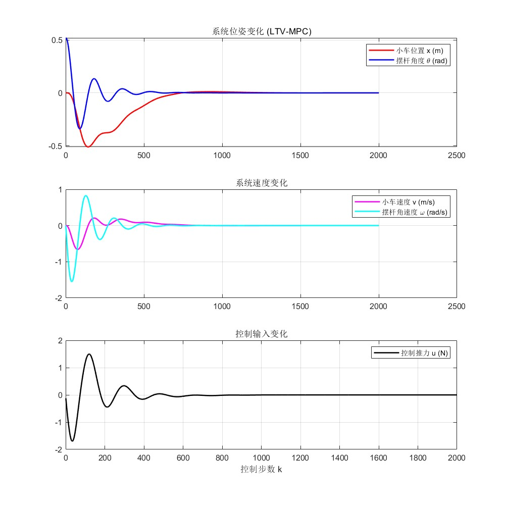
    <br>
    图5：MATLAB代码运行结果
</div>

<div align="center">
    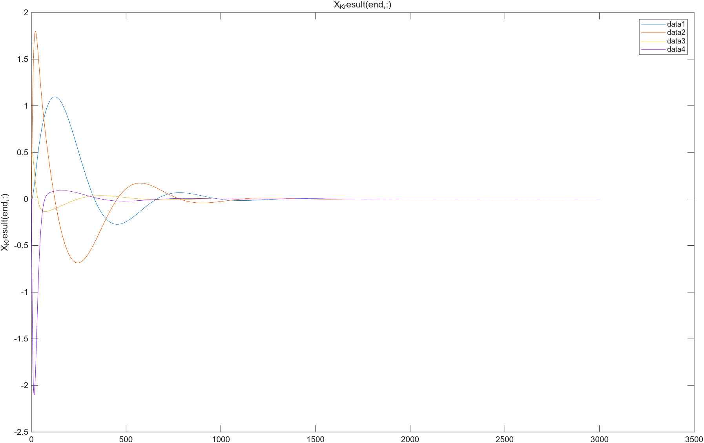
    <br>
    图6：C++代码运行结果
</div>

注意:以上输出不同因为给定的输入限幅不一样
### 3、非线性MPC：mujoco环境部署
使用`pybind11`建立python到C++之间的桥梁，使用这个工具将C++代码编译为python的动态库，`pybind1`的简单使用可以查看博客：https://www.cnblogs.com/smartljy/p/18608727  
首先将C++代码重构为控制器的类(class)，重构的文件为`scr/CartpoleMPC.cpp`与`include/CartpoleMPC.h`  
编译过程:  
在使用python的时候，选择了使用conda的混合编程，也就是说电脑环境里面同时存在了conda的虚拟环境和电脑本机的python环境，在使用的时候，电脑环境可能是python3.10，而conda环境可能是3.13，因此就要用conda的python环境为基准进行编译，下面为编译过程截图

<div align="center">
    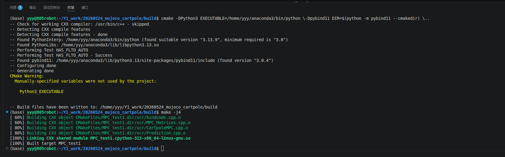
    <br>
    图7：编译过程
</div>

注意:在使用这种方式编译之前，需要重新清空、配置编译环境，在bulid目录下，使用命令`rm -rf *`清空所有缓存，这个命令如果用错了目录，会导致所有文件被删除，更加合适的方式:`rm -rf build/ && mkdir build && cd build`  

编译代码（需要在build目录使用）:
```
cmake -DPython3_EXECUTABLE=/home/yyy/anaconda3/bin/python \-Dpybind11_DIR=$(python -m pybind11 --cmakedir) \..
```
在编译之后，build环境里面就会出现新的文件，全称为`build/MPC_test1.cpython-313-x86_64-linux-gnu.so`，注意文件名的pythopn版本一定要与环境的python版本一样:

<div align="center">
    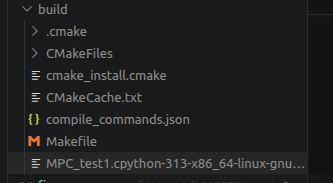
    <br>
    图8：编译生成文件
</div>

这个文件就是可以在python环境下运行、调用的**动态链接库文件**  
注意事项:  
bindcode文件里面，文件名字(MPC_test1)必须和`CMakeLists.txt`的文件名字是一样的，否则就会报错
`PYBIND11_MODULE(MPC_test1, m) `
#### 3.1 测试文件:python_code/pytbind_test.py 运行结果
在运行的时候，首先要进入你所定义的环境  
然后进入该程序所在的目录，在该目录下，输入代码`python pytbind_test.py`,即可出现运行结果，运行过程及其结果如下图所示

<div align="center">
    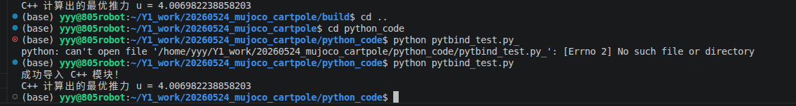
    <br>
    图9：pybind测试计算结果
</div>

下面，将开始在这个.so文件的基础上，加入输入和输出
#### 3.2 输入输出测试:mujoco_io.py运行结果
输入展示:

<div align="center">
    
    <br>
    图10：mujoco_io.py运行结果
</div>

输入获取如下图:

<div align="center">
    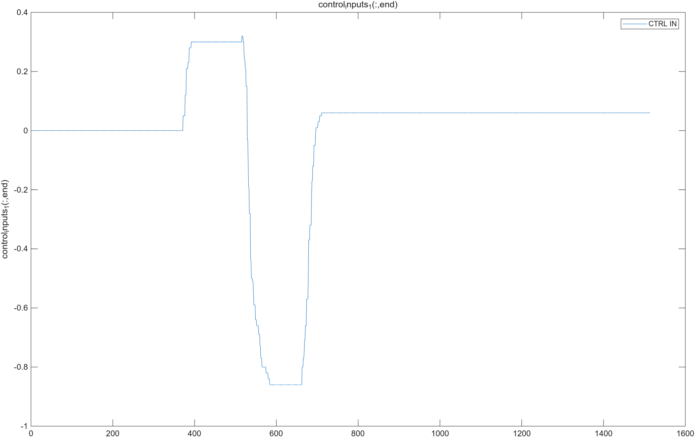
    <br>
    图11：输入参数获取
</div>

输出获取如下图:

<div align="center">
    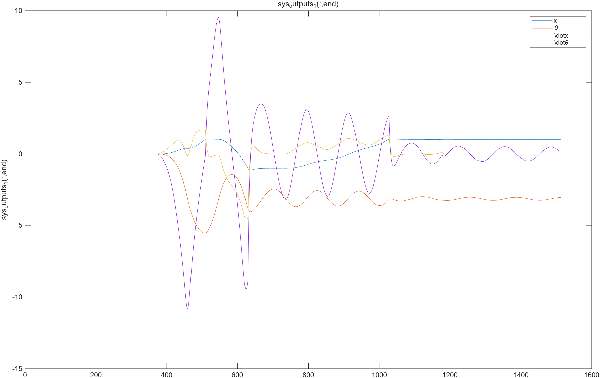
    <br>
    图12：输出参数获取
</div>

#### 3.3 加入控制器测试:cartpole_MPC.py
对倒立摆采取镇定控制，加入非线性MPC控制器  
第一次运行问题:  
C++环境一直发散，首先要检查代码计算的A和B矩阵是否正确，在C++代码中，利用下面结构输出两个矩阵:
```c++
if(first_print)
{
    std::cout << "\n===== Ac =====\n";
    std::cout << Ac << std::endl;

    std::cout << "\n===== Bc =====\n";
    std::cout << Bc << std::endl;

    first_print = false;
}
```
在MATLAB代码中，在命令行输入下面命令输出两个矩阵:
```MATLAB
x_test = [0.05;0;0.05;0];
u_test = 0;

Ac_test = A_func(x_test,u_test)
Bc_test = B_func(x_test,u_test)
```
在我的第一次运行中，我的MATLAB输出矩阵参数为:  

<div align="center">
    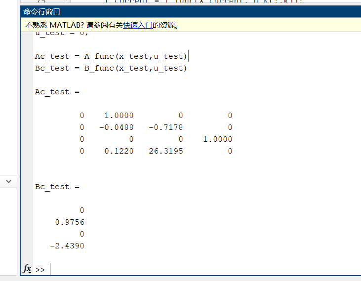
    <br>
    图13：MATLAB计算A、B矩阵参数
</div>

而我的C++输出矩阵参数为:

<div align="center">
    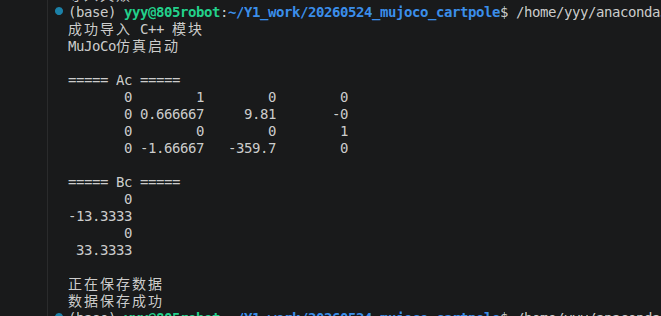
    <br>
    图14：C++计算A、B矩阵参数
</div>

后面在修改为正确的除法运算后，输出的A、B矩阵参数为:

<div align="center">
    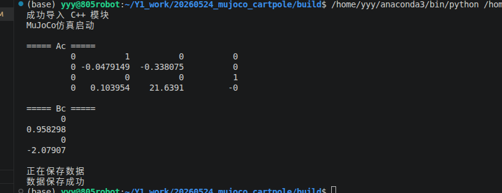
    <br>
    图15：C++计算A、B矩阵参数正确结果
</div>

注意:python代码在运行的时候，尽量指明代码是在那一个环境下的python运行的，比如我在运行的时候，就会使用:`/home/yyy/anaconda3/bin/python /home/yyy/Y1_work/20260524_mujoco_cartpole/python_code/cartpole_MPC.py`，其中，`/home/yyy/anaconda3/bin/python`就是我使用的conda环境

注意: 本人的cartpole修改了部分长度、输出范围等属性，原始的文件查看github或者model/cartpole_ori.xml  

# 最终效果

<div align="center">
    
    <br>
    图16：30度初始扰动输出曲线
</div>


<div align="center">
    
    <br>
    图17：45度初始扰动输出曲线
</div>

<div align="center">
    
    <br>
    图18：70度初始扰动输出曲线
</div>

可以看到，哪怕最后初始扰动到了70度非线性MPC依然能拉回原点，这点比根据**零点进行泰勒展开**的MPC更强，关于零点进行泰勒展开的相关代码可以查看我的仓库: https://github.com/yzjjx/MPC-python-with-mujoco-test ，下面给出70度测试的输入与输出曲线:

<div align="center">
    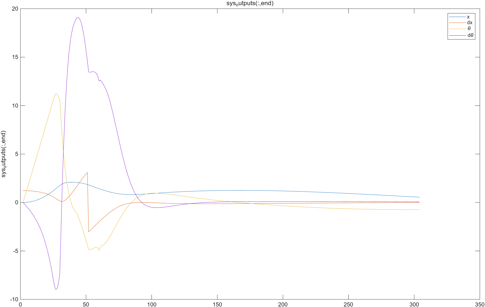
    <br>
    图16：70度初始扰动输出曲线
</div>


<div align="center">
    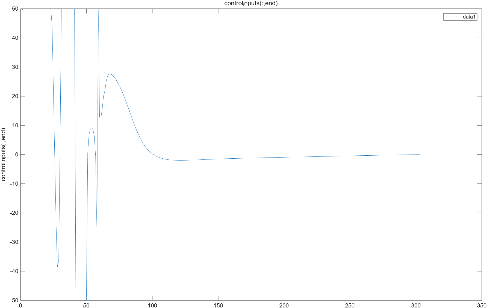
    <br>
    图17：70度初始扰动输入曲线
</div>

# 参考:  
DR_CAN视频：https://www.bilibili.com/video/BV1cL411n7KV/?spm_id_from=333.337.search-card.all.click&vd_source=edb1e1f22b9c76d7715e5e74a6a02b53

# 注意事项:
在该公式中，我仍然没有加入偏置项，在后期的工程中会加入偏置项求解，进行相关仿真